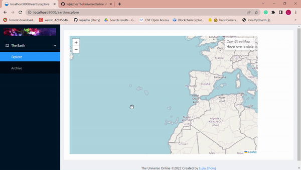

# TheUniverseOnline
An application based on ReactJS for exploring the universe, mainly the Earth for now. Pictures for landscape and different countries are still in shortage and will be added more.

<center>
  
</center>

## Development Environment
Project Framework：ReactJS + Ant Design

Development IDE：IntelliJ IDEA

Transcompiler: UmiJS (between ES6/JSX and ES5)

Routing and State Management: DVA (split Model/data from View/page)

Geojson: Leaflet

## Run

1. Start a container
```
docker run --rm -it -p 8000:8000 node:14 /bin/bash
```

2. Install umi
```
yarn global add umi@3.5.32
```

3. Install dependencies/packages.
```
yarn install
```

4. Run
```
umi dev
```
